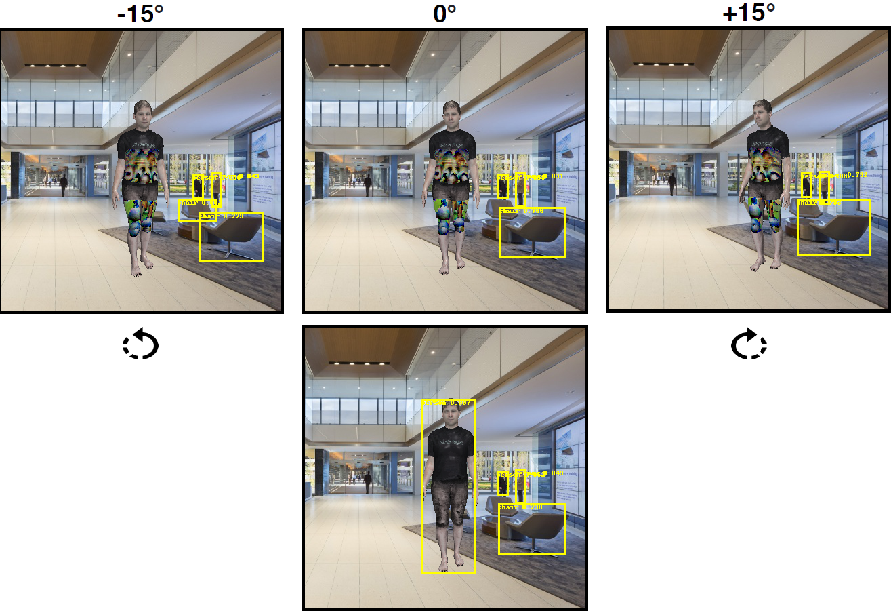
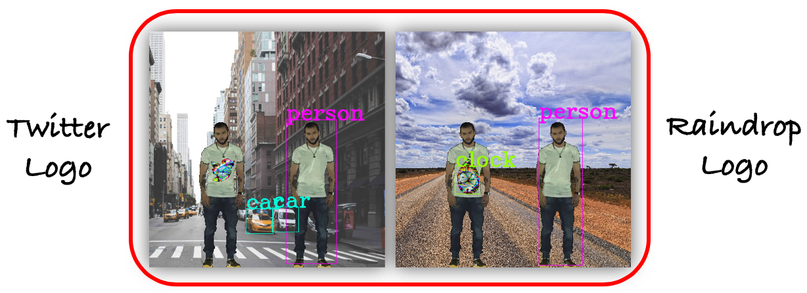
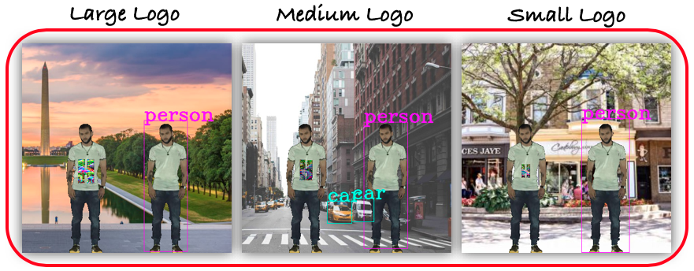
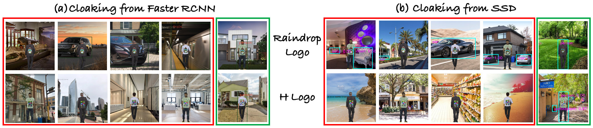
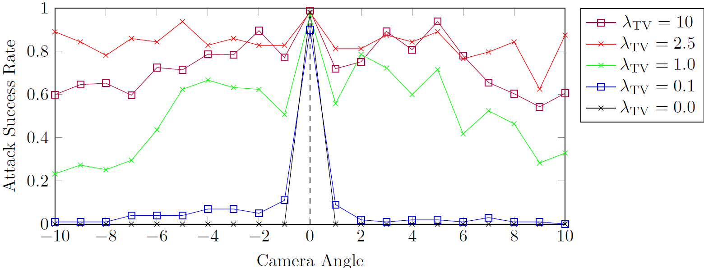

## Project Description

This project we’ve developed a novel patch-based adversarial attack pipeline that trains adversarial patches on 3D human meshes. This new 3D adversarial patch is shown to fool state-of-the-art deep object detectors robustly under varying views, potentially leading to an attacking scheme that is persistently strong in the physical world.




## Algorithm

The 3D adversarial logo pipeline. We start with the reference SMPL  model, and sample its faces to form a desired logo shape. The SURREAL  dataset is used to create a wide variety of body poses and mesh textures during training and testing. The logo texture atlas defined by the sampled faces is then randomly perturbed, and appended to our human meshes. These meshes are rendered using PyTorch3D, and imposed upon real-world background images. Finally, the synthesized images are fed through various object detectors, which allows for the computation of disappearance loss. As the whole pipeline is differentiable, we back-propagate from the losses, to the "Logo Texture Atlas'' along the green arrows.


## Visualization Results

The example of adversairal attack.


We have different scaling of attack.


We also demonstrate the performance of unseed detector attacking:



The TV regularization over meshes has great effect on attacking success rate in our problem.




## People

*   [Arman Maesumi](https://armanmaesumi.github.io/)
*   Mingkang Zhu
*   Tianlong Chen
*   Yi Wang
*   [Dr. Atlas Wang](https://vita-group.github.io/)
*   Dr. Chandrajit Bajaj

## Code Repo

[Github link](https://github.com/CVC-Lab/3D_ADV_Mesh_pytorch3d)

## Paper

[Arxiv](https://arxiv.org/abs/2104.11101)

## Cite Us

```
@article{maesumi2021learning,
  title={Learning Transferable 3D Adversarial Cloaks for Deep Trained Detectors},
  author={Maesumi, Arman and Zhu, Mingkang and Wang, Yi and Chen, Tianlong and Wang, Zhangyang and Bajaj, Chandrajit},
  journal={arXiv preprint arXiv:2104.11101},
  year={2021}
}
```