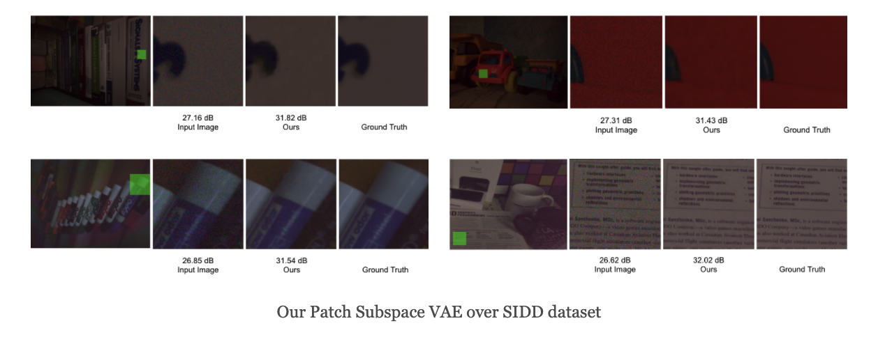
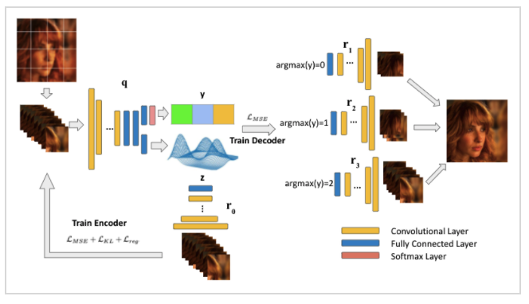
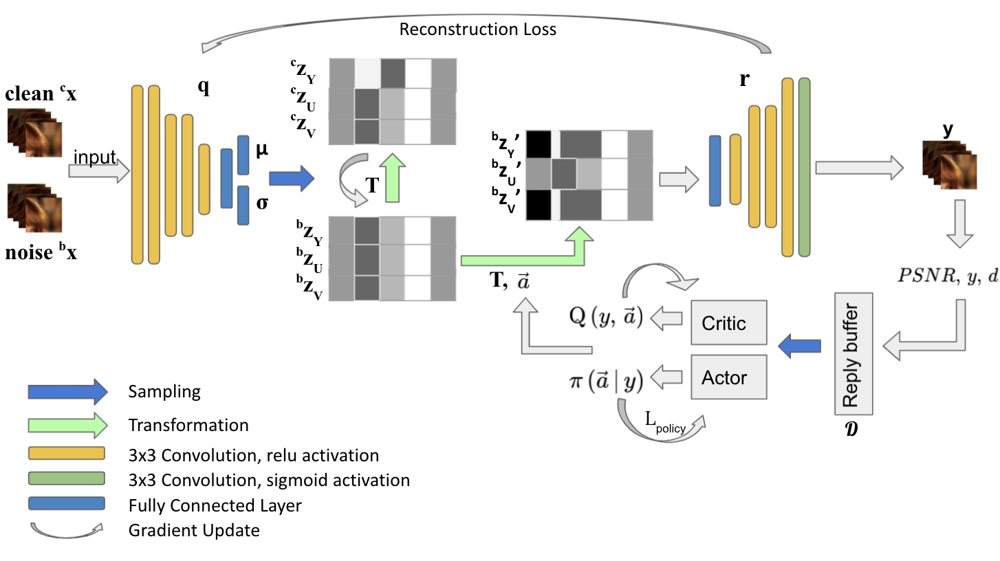
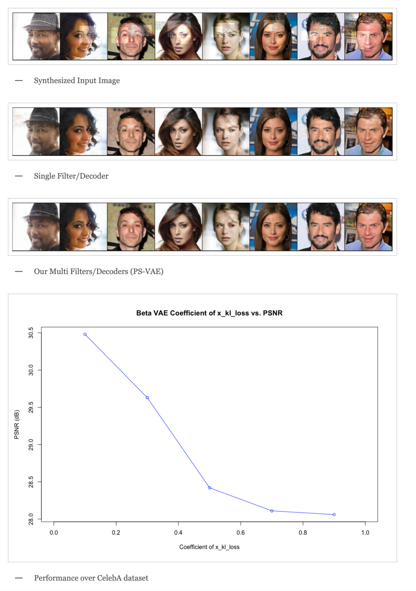
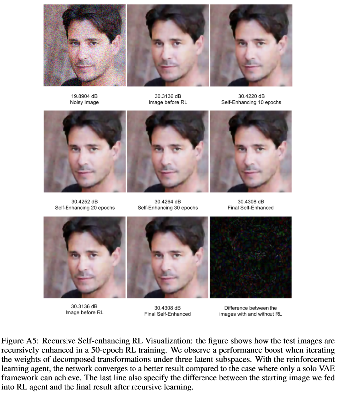

### [Computational Visualization Center Wordpress Link](https://cvcweb.oden.utexas.edu/cvcwp/projects/cameraisp/)
## Project Introduction

Heterogeneity exists in most camera images. This heterogeneity manifests itself across the image space as varied Moire ringing, motion-blur, color-bleaching or lens based projection distortions. Moreover, combinations of these image artifacts can be present in small or large pixel neighborhoods, within an acquired image. Current camera image processing pipelines, including deep trained versions, tend to rectify the issue applying a single filter that is homogeneously applied to the entire image. This is also particularly true when an encoder-decoder type deep architecture is trained for the task. In this paper, we present a structured deep learning model that solves the heterogeneous image artifact filtering problem. We call our deep trained model the Patch Subspace Variational Autoencoder (PS-VAE) for Camera ISP. PS-VAE does not necessarily assume uniform image distortion levels nor similar artifact types within the image. Rather, our model attempts to learn to cluster different patches extracted from images into artifact type and distortion levels, within multiple latent subspaces (e.g. Moire ringing artifacts are often a higher dimensional latent distortion than a Gaussian motion blur artifact). Each image’s patches are encoded into soft-clusters in their appropriate latent sub-space, using a prior mixture model. The decoders of the PS-VAE are also trained in an unsupervised manner for each of the image patches in each soft-cluster. Our experimental results demonstrates the flexibility and performance that one can achieve through improved heterogeneous filtering. We compare our results to a conventional one-encoder-one-decoder architecture.

Further, our RSE-RL model views the identification and correction of artifacts as a recursive self-learning and self-improvement exercise and consists of two major sub-modules: (i) The latent feature sub-space clustering/grouping obtained through an equivariant variational auto-encoder enabling rapid identification of the correspondence and discrepancy between noisy and clean image patches. (ii) The adaptive learned transformation controlled by a trust-region soft actor-critic agent that progressively filters and enhances the noisy patches using its closest feature distance neighbors of clean patches. Artificial artifacts that may be introduced in a patch-based ISP, are also removed through a reward based de-blocking recovery and image enhancement.We demonstrate the self-improvement feature of our model by recursively training and testing on images, wherein the enhanced images resulting from each epoch provide a natural data augmentation and robustness to the RSE-RL training-filtering pipeline



`video: https://youtu.be/tk-uXrNy62w`

## PS-VAE

The overall pipeline of our PS-VAE. The entire training process is a two-fold step: we train the single encoder to achieve the best latent encoding with a latent vector maximally separating patches into subspaces and a dummy decoder. Then, we train multiple decoders with the encoder and the latent space to be fixed.



## RSE-RL

The overall pipeline of our RSE-RL: For each given observed image, we split the image into local patches and feed every patch as a stack into the encoding network. The latent space is divided into three subspaces, the encoder projects the YUV features of the patches onto three latent subspaces $Z_y$, $Z_u$, and $Z_v$. Both the clean patches and noisy patches are projected onto the three spaces. A set of transformations $T$ are learned to transform the latent representation of the noisy patches to a corresponding representation of the clean patches in all three subspaces. The transformed noisy representations are sent to the decoder for image reconstructions. After the denoised images are constructed, a PSNR is calculated and used to obtain the reward for a soft-actor-critic reinforcement learning model. The RL model uses the distance from the target PSNR and actual PSNR as the reward to adjust the trainable weights in the transformation $T$. Hence we have a self-enhancing image denoising network.



## Results

### PS-VAE



### RSE-RL



## Project Members
* Yunhao Yang
* Yuhan Zheng
* Yi Wang
* Dr. Chandrajit Bajaj

## Code Repo

[Github link](https://github.com/CVC-Lab/RSE-RL)

## Paper (Preprint)

[Learning Deep Latent Subspaces for Image Denoising](https://arxiv.org/abs/2104.00253)

[Recursive Self-Improvement for Camera Image and Signal Processing Pipeline](../../../images/projects/camera_isp/RSE_RL.pdf)

## Cite Us

```
@article{yang2021learning,
  title={Learning Deep Latent Subspaces for Image Denoising},
  author={Yang, Yunhao and Zheng, Yuhan and Wang, Yi and Bajaj, Chandrajit},
  journal={arXiv preprint arXiv:2104.00253},
  year={2021}
}
```

## Acknowledgement

This research was supported in part by a grant from NIH - R01GM117594, in part from the Peter O’Donnell Foundation, and in part from a grant from the Army Research Office accomplished under Cooperative Agreement Number W911NF-19-2-0333. The views and conclusions contained in this document are those of the authors and should not be interpreted as representing the official policies, either expressed or implied, of the Army Research Office or the U.S. Government. The U.S. Government is authorized to reproduce and distribute reprints for Government purposes notwithstanding any copyright notation herein.