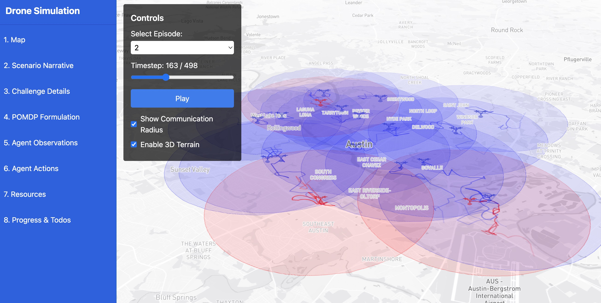

<!-- ---
title: "Dynamic Belief Games"
slug: "/projects/dynamic-belief-games"
date: "2024-09-12"
---

*Figure: A visual of our DBG gym, demonstrating a drone swarm scenario.*

## What are we trying to do?

The goal of this project is to develop Predictive Intelligent Networking (PIN) agents capable of rapid response decision-making in dynamic, adversarial communication networks. Our next-generation AI-trained PIN agents are designed to enhance their capabilities through continual field training with adversarial agents, leveraging a Dynamic Belief Games framework. This framework fosters learning across diverse interactions, where agents adapt to and optimize under various adversarial scenarios.

Our approach aims to automate the setup and deployment of the primary, alternate, contingency, and emergency (PACE) communications plan, reduce overhead traffic, and improve scalability in sparse and challenging network environments.

## What is the problem?

In dynamic communication networks, agents must continuously adapt to rapidly changing conditions and adversarial behavior. Network sparsity, unpredictable adversaries, and the challenge of maintaining efficient communication under constrained resources pose significant obstacles to efficient and secure communication.

## Why is it hard?

The complexity arises from the dynamic nature of adversarial networks, where conditions can change rapidly, and agents must continually learn from interactions. Traditional methods of network optimization are insufficient to handle the dynamic and adversarial nature of these environments, requiring novel AI-driven approaches that can operate with incomplete and uncertain information.

## How is it done today, and what are the limits of current practice?

Currently, network optimization is based on static models or fixed algorithms that cannot easily adapt to changes in network conditions or adversarial behavior. The limits of current practice include inefficiency in handling dynamic adversarial environments, high overhead traffic, and the inability to automate communications planning across varying conditions.

## What we’re doing.

Our approach involves developing and training AI-based PIN agents within the Dynamic Belief Games framework. These agents engage in adversarial interactions and cross-training to learn optimal action selection strategies that reduce traffic overhead, automate PACE communications planning, and enhance network scalability in complex terrains. By integrating machine learning with game theory, we are creating agents that can respond dynamically to adversarial threats and network conditions.

## Hiring Opportunities

Our Dynamic Belief Games (DBG) project was recently funded for three years, and we welcome candidates from various disciplines, including Mathematics, Physics, Computational Science, and Computer Science. We’re flexible with options for:

1. Students interested in potentially continuing towards a Math Ph.D.
2. Students with relevant qualifications interested in this as a side project.

The project is a blend of game theory, optimization, and optimally controlled Markovian decision processes for stochastic communication networks. This work is broadly applicable to predictive modeling in dynamical systems.

Candidates with knowledge of cooperating/non-cooperating stochastic processes and experience minimizing empirical risk measures (stochastic functionals) are encouraged to apply. These measures are tailored for proactive maintenance and performance in stochastic communication networks.

**We are also seeking MS and PhD graduate students to join our team. Interested candidates can email us directly at:**

- **Ryan Farell:** ryan.farell@utexas.edu
- **Chandrajit Bajaj:** bajaj@cs.utexas.edu

### Postdoctoral Fellow

This role involves working on cutting-edge AI networking technologies under the guidance of Prof. Chandrajit Bajaj at the University of Texas at Austin. The position focuses on the development of PIN agents and advanced AI techniques for real-time decision-making in dynamic networks.
[Apply Here](https://utaustin.wd1.myworkdayjobs.com/en-US/UTstaff/job/Postdoctoral-Fellow_R_00033359)

### Software Engineer

Join our team to contribute to the development of advanced software solutions for AI-driven network optimization. This position will involve designing, implementing, and testing software systems for scalable, secure communication networks.
[Apply Here](https://utaustin.wd1.myworkdayjobs.com/en-US/UTstaff/job/AUSTIN-TX/Software-Engineer_R_00033287?q=computer+science)

### IT Network Security Specialist

We are seeking a security specialist to ensure the integrity and security of our AI-optimized networks. This role will involve managing network infrastructure and developing security protocols for predictive communication systems.
[Apply Here](https://utaustin.wd1.myworkdayjobs.com/en-US/UTstaff/job/AUSTIN-TX/IT-Network-Security-Specialist_R_00033229?q=computer+science)

### Announcement

We are also excited to share our upcoming training session on AI at the University of Texas. Check out the details [here](https://dra.utexas.edu/trainingAI).

## Funding

This project is funded by the Army.

## People

- Chandrajit Bajaj (Principal Investigator) [(website)](https://www.cs.utexas.edu/~bajaj/cvc/index.shtml)
- Ryan Farell (Lead Research Scientist) [(website)](https://rfarell.github.io/index.html)
- Luke McLennan (PhD Student)
- Aaron Dominick (PhD Student)
- Matthew Kim (Technical Staff)
 -->
