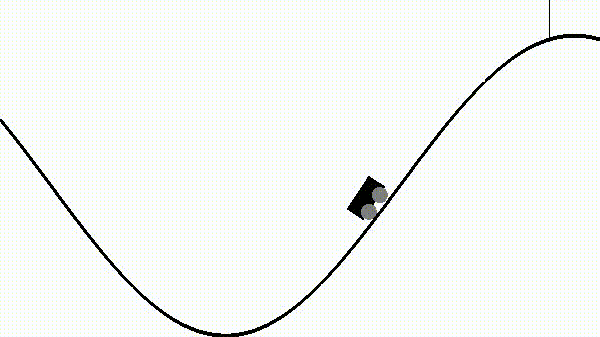
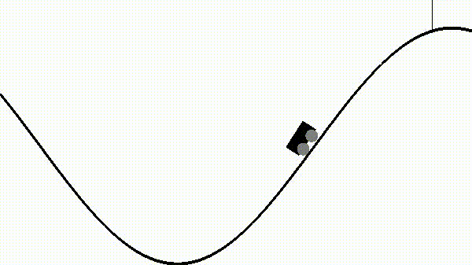

## Project Description
Learning optimal control solutions for unknown dynamical systems, where an objective cost functional is optimized over space-time, is known to be computationally identical to convergently arriving at an optimal policy capturing optimal value paths with maximum reward and minimum regret, in reinforcement learning. The solutions to such reinforcement learning methods involves techniques from many areas of scientific endeavour including mathematics, statistics, physics, engineering, and computer science. Several reinforcement learning algorithms have been devised to attempt to compute these optimal control paths through optimal policy learning . In this project, we take a more comprehensive approach. We rely on both the physical nature of the dynamical system data and the requirements of the optimal control problem. We learn the underlying reduced Hamiltonian dynamics and then learn to  utilize this reduced dynamics to optimally control the dynamical system for targeted objectives. We focus on the  continuous-time version of the optimal control optimization problem and solve that optimization over both finite-dimensional and infinite-dimensional state spaces.  By using the Pontryagin maximum principle, we reduce the problem to a specific form of Hamiltonian dynamics learning. The control is now encoded into the adjoint variable, and the new task is to learn this adjoint variable as well as the reduced Hamiltonian. This is fundamentally different from optimal policy driven reinforcement learning, which focuses on deriving optimal action and value functions

## Main Motivation
The standard formulation for reinforcement learning with value function and dynamic programming essentially follows an integral formulation. The number of time steps required for each simulation/episode where agent interacts with environment is often large. For shape optimization problems in engineering design such as airfoil design problem, such simulations can be very costly. We would like to find a way in which we can do both reinforcement learning, and at the same time extract the underlying physical "differential" properties of the optimal policy for any agent. We hope that extracting such "differential" properties, which can be characterized by certain functions (neural networks) with only small amount of parameters, would require a lot less number of time steps per simulation/episode. Nonetheless, there are many issues that we are considering including: sample efficiency and robustness. For example, agent needs to be able to have a good policy for any initial starting point. Covering all initial starting point is impossible, and a sample-efficient scheme is needed. Moreover, these starting points samples must "work" together to output the correct "differential" properties that we need. At the same time, agent must keep in mind that its interactions/outputs from environment is noisy. All of these factors make the problem more complicated than learning a single "differential" network for optimal policy.

## Mountain Car Demo
Untrained agent

Trained agent with VAE

## Code Repo
[Github link](https://github.com/mpnguyen2/neural_pmp)

## People
* Minh Nguyen (PhD)
* Prof. Chandrajit Bajaj