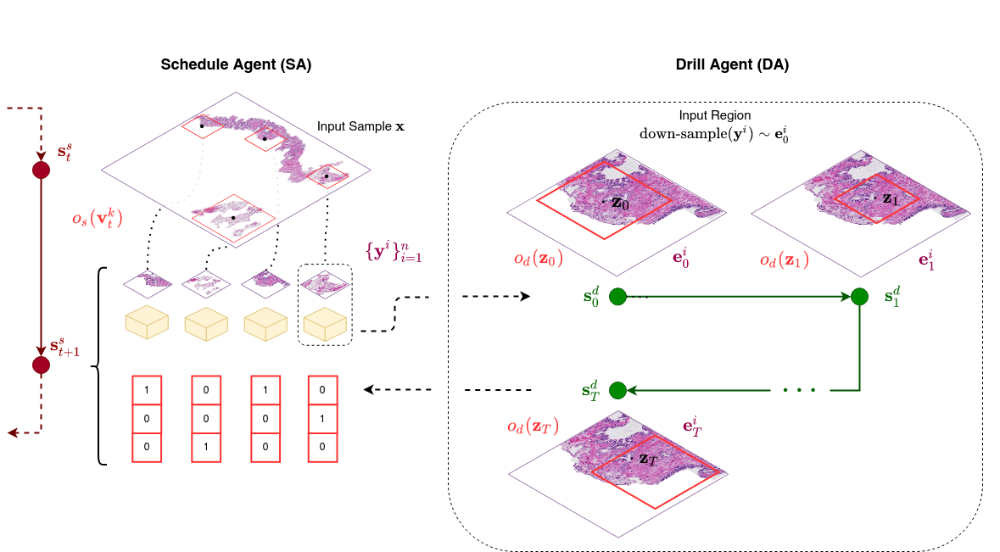
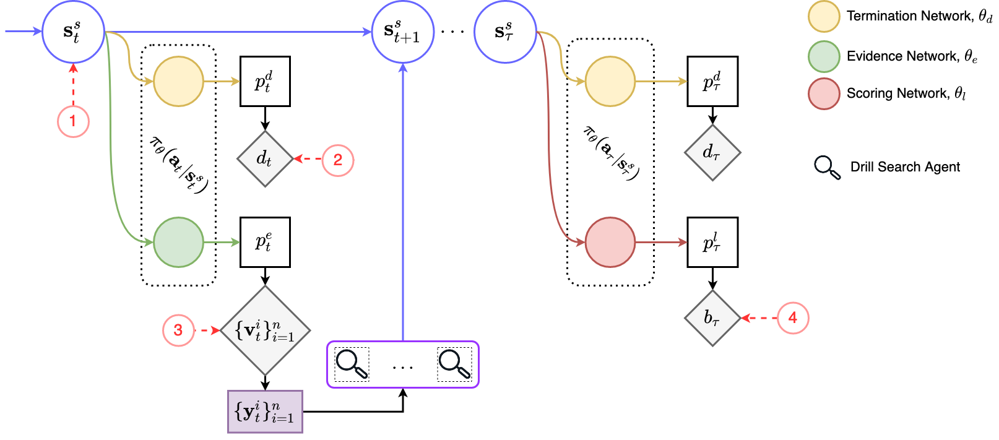
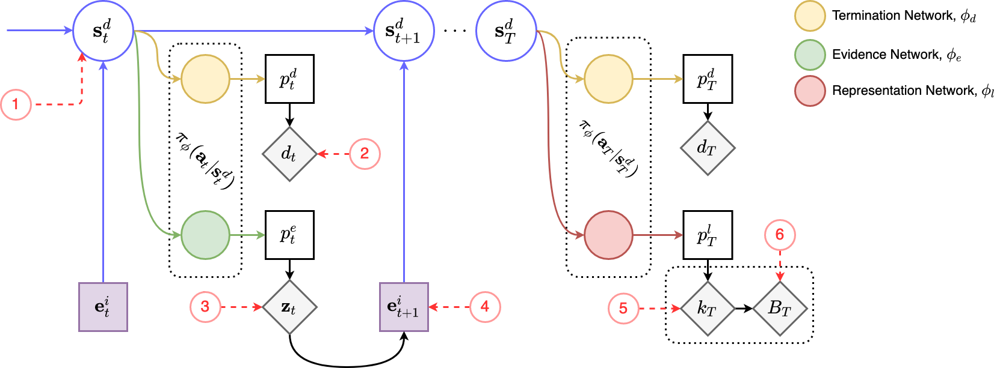

## Project Introduction

Rapid search (detection & localization) and full recognition (classification with ranking and scoring) in ultra-high resolution giga-pixel images has been hampered by the sheer size of the image "haystack". Moreover, informative features (aka. needles) for recognition need to be discerned at multiple zoom levels, permissible due to the ultra-high image resolution. Applications that routinely generate andrequire search and recognition giga-pixel images include digital pathology based on ultra-scanned stained tissue biopsies (aka. Whole Slide Images (WSIs) that are typically 100K pixels × 100K pixels), and wide-area and panoramic surveillance including whole earth remote sensing (5 - 7 Gigapixel images with different aspect ratios). Digital pathology systems that are based on WSIs require full recognition (i.e., classification with Gleason scoring and ranking). In this paper, we develop a Multi-Agent Reinforcement Learning (MARL) framework for rapid search-and-score of giga-pixel images. Instead of exhaustively processing WSIs at the finest zoom detail, our RL method learns to optimally select patches of the WSI, and score them. Additionally the master agent trains slave agents to learn a task driven policy for statistically image processing the patches at the minimal required zoom level, and within a pre-defined uncertainty.

An illustration of the proposed MARL pipeline. **Left:** Scanning search is performed on input giga-pixel image by SA. Patches are identified and concurrently operated on by DAs. **Right:** A single trajectory of DA is illustrated. DA selects sub-regions from observed region belonging to the patch indexed. DA terminates returning select representations of characteristic patterns (e.g., select information mask, topological or structural information etc.). Next state of the SA, composed of patch-location, score matrix and optimal representation, is used by SA in identifying next set of patches for scheduling or in deciding to terminate the search returning score.

## Rank-ordered Search-and-Score

We target the challenging family of problems where information categories (i.e, entity components and their sub-components) that make up the tasks' *rank-ordered rubric* are ranked by importance. Furthermore, entities are hierarchical spanning multiple levels of scale and sparsely distributed within a large search space. Generally speaking, such problems are characterized by higher-ranked categories more sparse than lower-ranked categories. They stress the importance of performing efficient search and the possibility of exploiting underlying structure of the scoring rubric for prioritized search. For example, in the medical domain of pathology, irrelevant information or noise occupies majority of the search space (e.g., slide background in whole slide tumor scan images. As a result, the distribution of information categories associated with the task-dependent scoring scheme in rank-ordered search problems are highly imbalanced. Based on categorization of task-dependent scores and memory limitations dictating maximum observable information of the search space, an attempt to rapidly perform rank-ordered search and score will have to: (1) identify and capture inter-dependence of hierarchically distributed features; and (2) learn a sample efficient search strategy that exploits patterns in the data distribution for rank-ordered search.

## MARL Search-and-Score

At each time step, patch location set is predicted. SA transitions to state constructed from patch location, label, and pattern characterization representation returned by DA. Otherwise, SA may terminate search based on the state and produce a score. Negative reward is received, reflecting the computational cost of performing drill search on these patches and a positive reward if predicted score matches ground truth.

At each zoom action, a region is selected for observation. Each selection receives a negative reward reflecting the computational cost of sampling. Otherwise, DA may terminate search and representations of characteristics is returned to SA.

## HRL Search-and-Score

## Results

### MARL Search-and-Score

### HRL Search-and-Score

## Project Members
[Rochan Avlur Venkat](https://rochan-a.github.io), Conrad Li, Kartikeya Badola, Priyansh Kedia, [Dr. Chandrajit Bajaj](https://www.cs.utexas.edu/~bajaj/)

## Code Repo

[Github link](https://github.com/CVC-Lab/mvrl-wsi-pathology/)

## Paper(Under preperation)

[Active Learning of Multi-Agents to Rapidly Search and Score Giga-Pixel Images]()

[Towards Hierarchical Annotation of Prostate Cancer Whole Slide Images]()
