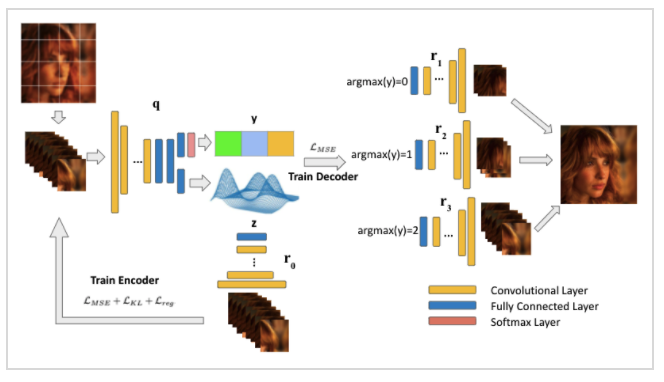
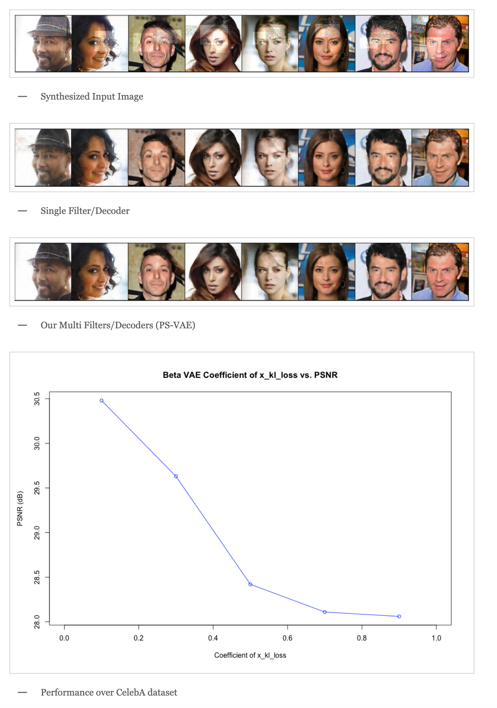

## Project Introduction

Heterogeneity exists in most camera images. This heterogeneity manifests itself across the image space as varied Moire ringing, motion-blur, color-bleaching or lens based projection distortions. Moreover, combinations of these image artifacts can be present in small or large pixel neighborhoods, within an acquired image. Current camera image processing pipelines, including deep trained versions, tend to rectify the issue applying a single filter that is homogeneously applied to the entire image. This is also particularly true when an encoder-decoder type deep architecture is trained for the task. In this paper, we present a structured deep learning model that solves the heterogeneous image artifact filtering problem. We call our deep trained model the Patch Subspace Variational Autoencoder (PS-VAE) for Camera ISP. PS-VAE does not necessarily assume uniform image distortion levels nor similar artifact types within the image. Rather, our model attempts to learn to cluster different patches extracted from images into artifact type and distortion levels, within multiple latent subspaces (e.g. Moire ringing artifacts are often a higher dimensional latent distortion than a Gaussian motion blur artifact). Each image’s patches are encoded into soft-clusters in their appropriate latent sub-space, using a prior mixture model. The decoders of the PS-VAE are also trained in an unsupervised manner for each of the image patches in each soft-cluster. Our experimental results demonstrates the flexibility and performance that one can achieve through improved heterogeneous filtering. We compare our results to a conventional one-encoder-one-decoder architecture.

## Algorithm (PS-VAE)

The overall pipeline of our PS-VAE. The entire training process is a two-fold step: we train the single encoder to achieve the best latent encoding with a latent vector maximally separating patches into subspaces and a dummy decoder. Then, we train multiple decoders with the encoder and the latent space to be fixed.

## Results

